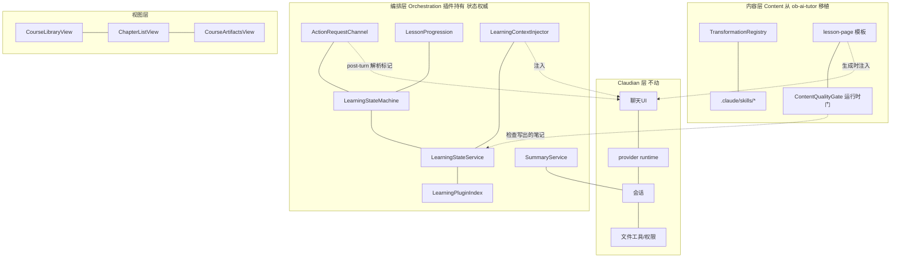
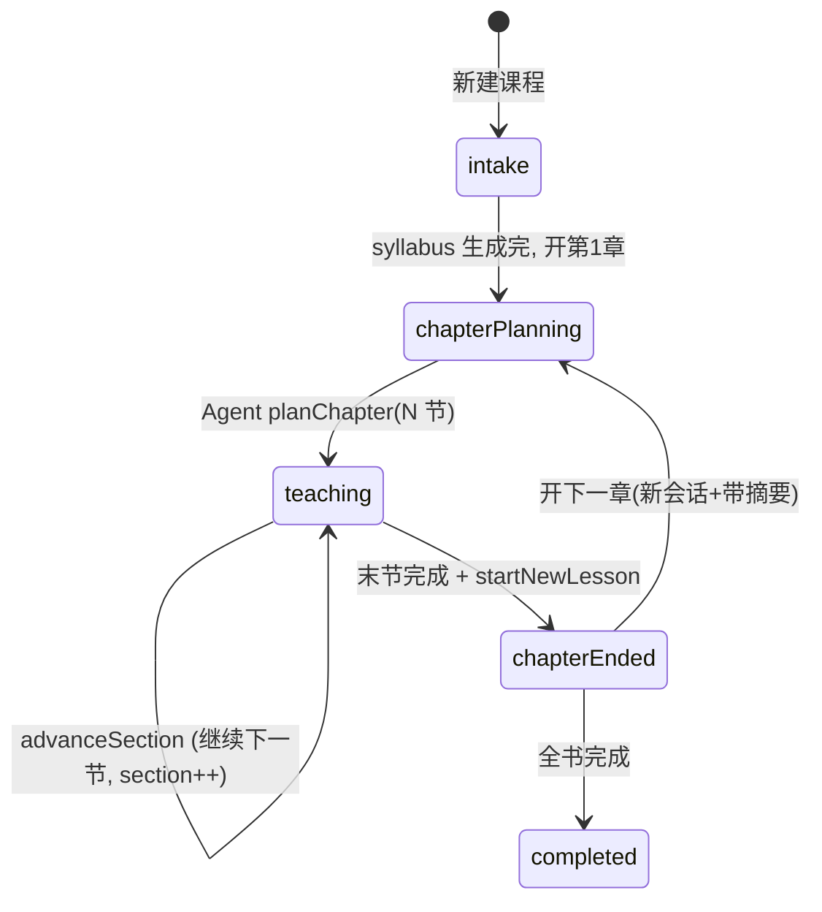
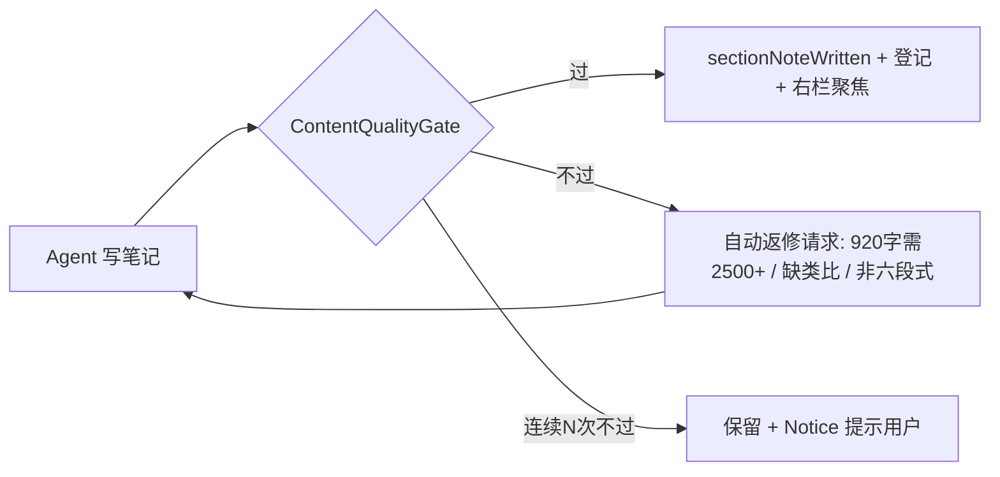
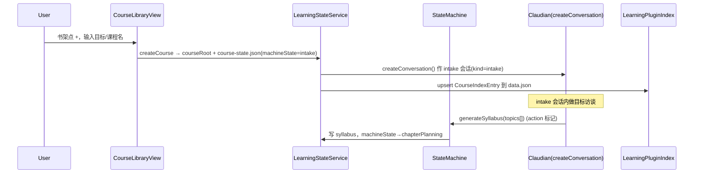
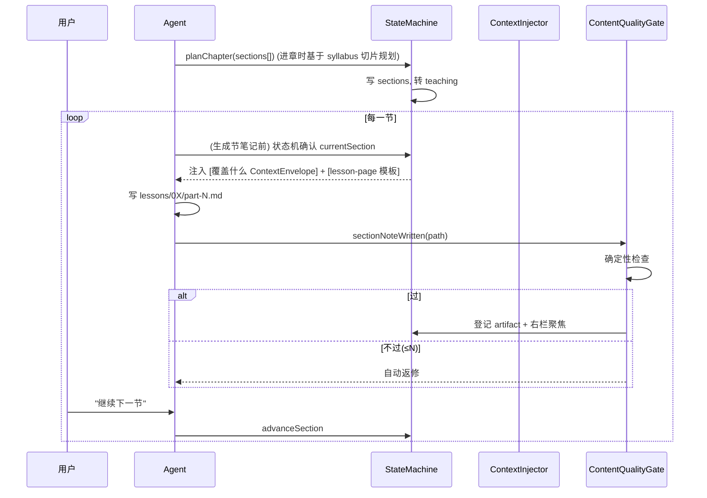
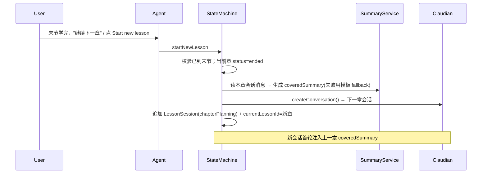

# Stage 01 Design: Claudian 学习版整合 MVP

状态：active

## 组织主轴：编排层 ⟂ 内容层（两层正交）

整个学习域分两大正交层，只在"生成一节笔记"那一刻汇合。改一层不影响另一层。

| | 编排层 Orchestration | 内容层 Content |
| --- | --- | --- |
| 管什么 | **何时**生成、**覆盖什么**、状态怎么变 | 生成出来**写成什么样** |
| 真相 | 插件状态机（唯一能改 `course-state.json`） | 写作规范/模板（从 ob-ai-tutor 移植） |
| 变更频率 | 流程稳定后少动 | 持续打磨（金句、反 AI 腔、深度） |

核心原则：**插件拥有"导航 + 状态真相 + 上下文组装 + 质量门"；Agent 拥有"对话 + 内容生成 + 写文件"。Agent 不直接改状态，只能向插件状态机提交请求；内容深度/质量由插件硬门控制，不靠 Agent 自律。**

## Architecture

在 Claudian fork 内新增学习域，聊天/runtime/provider 复用，对既有代码只做最小注入。



### 新增模块

| 层 | 模块 | 路径（fork 内） | 职责 |
| --- | --- | --- | --- |
| 编排 | `LearningStateMachine` | `src/features/learning/flow/LearningStateMachine.ts` | **唯一能改 course-state.json 的地方**；校验所有状态转移；拒绝越权请求 |
| 编排 | `LearningStateService` | `src/features/learning/state/LearningStateService.ts` | 持久化 `course-state.json`；经 vault adapter 读写 |
| 编排 | `LearningPluginIndex` | `src/features/learning/state/LearningPluginIndex.ts` | 通过 `plugin.loadData/saveData` 维护书架课程索引 |
| 编排 | `ActionRequestChannel` | `src/features/learning/flow/ActionRequestChannel.ts` | post-turn 解析 Agent 回复中的结构化 action 标记 → 交状态机 |
| 编排 | `LessonProgression` | `src/features/learning/flow/LessonProgression.ts` | 编排 planChapter / advanceSection / startNewLesson 的具体步骤 |
| 编排 | `LearningContextInjector` | `src/features/learning/context/LearningContextInjector.ts` | 组装当前章/节 ContextEnvelope（覆盖什么） |
| 编排 | `SummaryService` | `src/features/learning/flow/SummaryService.ts` | 读会话消息 → 后台生成 `coveredSummary`（复用 Claudian title-gen 机制） |
| 内容 | `TransformationRegistry` | `src/features/learning/content/TransformationRegistry.ts` | lesson-page / quiz / review / concept-card 四种命名生成意图 |
| 内容 | `ContentQualityGate` | `src/features/learning/content/ContentQualityGate.ts` | **运行时**对写出的笔记跑确定性质量检查 + 触发自动返修 |
| 内容 | seeded skills | `.claude/skills/{lesson-page,quiz,review,concept-card}/SKILL.md` | 从 ob-ai-tutor `skills/*` 种子化；完整写作模板 |
| 内容 | `learningAppendix` | `src/features/learning/prompt/learningAppendix.ts` | 学习身份 + 压缩版核心写作规范（常驻）+ action 请求约定 |
| 视图 | `CourseLibraryView` / `ChapterListView` / `CourseArtifactsView` | `src/features/learning/views/*` | 书架 / 左栏章节 / 右栏目录 |

### 注入点（改动 Claudian 既有文件）

| 文件 | 改动 |
| --- | --- |
| `src/main.ts` | `registerView` 三个学习视图；`addCommand` 打开书架；启动初始化 PluginIndex / StateService / StateMachine |
| 系统提示构造处 | 把 `learningAppendix()` 放进 `buildSystemPrompt` 的 `options.appendices` |
| `InputController.buildTurnSubmission` | 返回前：① 若当前 conversation 属于某章，注入 `<course_context>`；② 若本轮是"生成某节笔记"，额外注入 lesson-page 模板 |
| assistant turn 完成钩子 | post-turn：`ActionRequestChannel` 解析 action 标记 → 状态机；`ContentQualityGate` 校验新写的笔记 |

## Data Model

### 插件级书架索引（`data.json`）

```ts
export interface LearningPluginData {
  learning?: { courses: CourseIndexEntry[] };
}
export interface CourseIndexEntry {
  courseId: string;
  goalTitle: string;
  title: string;
  rootPath: string;
  currentLessonId: string | null;
  updatedAt: number;
}
```

### 课程状态真相（`{courseRoot}/.ai-tutor/course-state.json`）

三层层级：**课程 Course → 章 Chapter(= 一个会话) → 节 Section(= 一篇笔记)**。

```ts
// src/features/learning/state/types.ts

export interface CourseState {
  schemaVersion: 1;
  courseId: string;
  goalTitle: string;            // "成为嵌入式 AI 开发工程师"
  title: string;                // "Linux AI 项目全链路实战"
  rootPath: string;
  createdAt: number;
  updatedAt: number;
  syllabus: SyllabusTopic[];    // 长大纲(CourseMap)；intake 阶段生成
  lessons: LessonSession[];     // 已累积的章（含 intake 章）
  currentLessonId: string | null;
  machineState: CourseMachineState; // 见状态机
}

export type CourseMachineState =
  | 'intake'          // 目标访谈 + 生成 syllabus
  | 'chapterPlanning' // 当前章待规划节
  | 'teaching'        // 当前章逐节推进
  | 'chapterEnded'    // 当前章已结，待开下一章
  | 'completed';      // 全书完成

export interface LessonSession {       // 一章 = 一个会话
  lessonId: string;
  kind: 'intake' | 'lesson';
  chapterNumber: number;               // 左栏显示的 "2."（intake 为 0）
  title: string;                       // "继电器与 LED 驱动原理"
  conversationId: string;              // ↔ Claudian conversation（核心映射）
  status: 'inProgress' | 'ended';
  sections: Section[];                 // 本章计划的节（Agent planChapter 提交）
  currentSectionIndex: number;         // 当前节
  coveredSummary?: string;             // 结章蒸馏，供下一章注入
  startedAt: number;
  endedAt?: number;
}

export interface Section {             // 一节 = 一篇笔记
  id: string;
  title: string;                       // "1. 继电器角色与驱动链路"
  status: 'pending' | 'noteWritten' | 'covered';
  notePath?: string;                   // 可点击打开的 vault 路径
}

export interface SyllabusTopic {
  id: string;
  title: string;
  covered: boolean;
}
```

冗余索引（便于左栏分组，不作真相）：Claudian `ConversationMeta` 上加可选 `learning?: { courseId: string; chapterNumber: number }`。**真相顺序：`course-state.json`（每门课完整状态）> `data.json`（书架入口索引）> conversation 冗余字段。**

## 状态机与 action 请求通道（编排层核心）

### 状态机



### Agent 能提交的请求 + 状态机校验

**Agent 不直接改 `course-state.json`。** 它在回复里发结构化 action 标记，插件 post-turn 解析后交状态机校验+应用+落盘。越权请求被拒并回提示。

| 请求（Agent 提交） | 前置条件（状态机校验） | 应用效果 |
| --- | --- | --- |
| `generateSyllabus(topics[])` | machineState == intake | 写 syllabus；转 chapterPlanning |
| `planChapter(sections[])` | machineState == chapterPlanning | 写本章 sections；转 teaching；currentSectionIndex=0 |
| `sectionNoteWritten(path)` | machineState == teaching | 当前节 status=noteWritten，notePath=path；触发质量门；右栏聚焦 |
| `advanceSection` | 当前节 status==noteWritten | currentSectionIndex++；越过末节 → 标记可结章 |
| `startNewLesson` | 已到末节 或 用户强制 | 本章 ended + SummaryService 生成 coveredSummary + 新会话 + 新章 chapterPlanning |

### 请求通道（MVP）

Agent 在回复中输出围栏块：

````
```ai-tutor-action
{"type":"advanceSection"}
```
````

`ActionRequestChannel` 在 assistant turn 完成后扫描该块 → 校验 → 应用。Provider-neutral，不依赖 MCP。**后续 Stage** 把高风险请求硬化成 Claude 的 MCP 工具。

## 内容层移植与质量强制

### 移植映射（从 ob-ai-tutor）

| ob-ai-tutor 资产 | 落到 fork |
| --- | --- |
| `skills/lesson-page-generation/SKILL.md` 等 | 种子化进 `.claude/skills/{lesson-page,quiz,review,concept-card}/`（完整模板） |
| 六段式 + 反 AI 腔 + 金句/锐度规范 | **核心条目压缩进 `learningAppendix`（常驻生效）**，完整版留 skill |
| `TransformationRegistry` 概念 | 四种命名生成意图，对应四个 skill |
| `scripts/verify-content.mjs` 确定性检查 | **双重身份**：CI 门（离线）+ **运行时门 `ContentQualityGate`**（每节笔记） |
| 8 维 rubric 的 LLM 裁判 | **后置**（深度/锐度，贵） |

### 质量强制：两个确定性杠杆（不靠 Agent 自律）

**杠杆 1 — 生成时注入模板。** 不指望 Agent"想起来调 skill"。状态机批准生成某节笔记时，编排层把**完整 lesson-page 模板直接塞进这一轮 prompt**（`buildTurnSubmission` 在生成节笔记的轮次注入）。模板 100% 在场。

**杠杆 2 — 生成后质量门 + 自动返修循环。** Agent 写完笔记，`ContentQualityGate` 立刻对 `.md` 跑确定性检查，不达标自动打回重写，循环到过线（≤ N 次），仍不过则保留并提示用户。



确定性检查项（秒级、零 LLM）：

| 检查 | 不达标 → 打回 |
| --- | --- |
| 篇幅 | < 2500 字 |
| 六段式结构 | 缺引子 / 主体 H2H3 / 小结预告 |
| 类比 | 0 个 |
| 反 AI 腔 | 出现"首先/其次/综上所述"套话 |
| 具体数字 | 通篇无具体数字/参数 |
| 源引用（挂材料时） | 无 `[n]` |

## Vault 文件结构（MVP）

```text
message/ob-ai-tutor/{course-slug}/
  .ai-tutor/
    course-state.json
  lessons/
    002-继电器与led驱动原理/
      _plan.md
      part-1-继电器角色与驱动链路.md
      part-2-...
```

## Interaction Flow

### 新建课程 → intake



### 进入课程（布局规则 — 不强排）

- 左栏 `ChapterListView`、右栏 `CourseArtifactsView` 用 Obsidian side leaf。
- 主区复用同一个 Claudian chat view，切到当前章 conversation。
- **不与 Obsidian 抢布局**：进入课程只保证打开左右 side leaf + 当前章会话；**笔记栏只在"生成下一节/新笔记时"自动聚焦那篇**，其余时间用户自由导航。布局是省时手段，不是强制。

### 规划本章 + 逐节生成（编排 ⟂ 内容 汇合点）



### Start new lesson（结章 → 下一章）



### 每轮上下文注入（首轮重、后续轻）

`buildTurnSubmission` 返回前，若 conversation 属于某章：

- **进入该章会话的首轮**：注入完整 `<course_context>`（课名、章号+标题、本章目标、上一章 `coveredSummary`、已有 artifacts）。
- **后续轮次**：provider session 已累积历史，仅注入轻量"当前章/节指针"，避免冗余 token。
- **生成节笔记的轮次**：额外注入 lesson-page 模板（质量杠杆 1）。

```
text = `${transformedText}\n\n<course_context>\n${envelope}\n</course_context>`
```

### Conversation 生命周期边界

- `LessonSession.conversationId` 是章的会话指针；`course-state.json` 是真相。
- provider 原生 session 失效 → 交 Claudian 现有恢复/重建机制。
- `conversationId` 对应 conversation 不存在 → 进入该章时创建 replacement conversation 并更新 `LessonSession.conversationId`；保留该章 sections / artifacts / coveredSummary。
- 本 Stage 不支持章会话 fork 的学习语义；fork 出的普通会话不自动成为 LessonSession。

### Artifacts 与 rename/delete

- `sectionNoteWritten` 时由状态机登记 `Section.notePath`。
- 用户 rename 笔记 → 监听 vault rename 事件，更新对应 `Section.notePath/title`。
- 用户删除笔记 → 保留 Section 缺失记录，不自动恢复；右栏显示缺失/空链接。

### 系统提示 appendix（learning identity，要点）

- 身份从 "Obsidian vault assistant" 切到 "AI 学习导师（Tutor）"。
- 写作：成体系内容写成 vault 笔记并用 `[[note]]` 指引；**写节笔记必须遵循本轮注入的 lesson-page 模板**；即时澄清留聊天。
- 状态：**不直接改 course-state.json**；推进/结章/规划等状态变更**通过 `ai-tutor-action` 标记提交**，由插件状态机裁决。
- 章节边界：一章聚焦当前覆盖范围，不展开未来章节；结章才推进。

## Compatibility

- 不改 Claudian runtime / provider / 权限 / Plan mode / inline-edit。
- 学习视图为独立 leaf，未进入课程时插件等同普通 Claudian。
- `ConversationMeta.learning`、`data.json` 的 `learning` 均为可选字段；旧数据仍有效。
- `course-state.json` 带 `schemaVersion`，后续 Stage 迁移用。

## Verification

- Jest 单测：
  - `LearningPluginIndex` / `LearningStateService` roundtrip + 重启恢复。
  - 状态机：合法转移成功、越权请求被拒（如未写笔记就 advanceSection）。
  - `ActionRequestChannel` 解析 `ai-tutor-action` 标记。
  - `startNewLesson` 携带上一章 coveredSummary。
  - `ContentQualityGate`：低于阈值的笔记被判不过并触发返修；达标通过。
  - 左栏分组排序；appendix 存在；`buildTurnSubmission` 首轮注入 `<course_context>`、生成轮注入模板。
- 手动验收：真实 Obsidian 跑通 User Scenarios 全流程一次。
- `npm test`（Jest）+ `npm run build` 通过。
