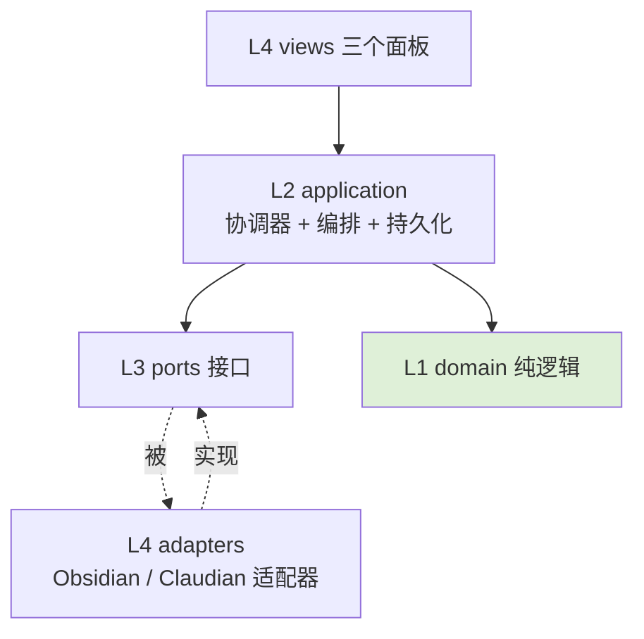

# Stage 03 Design: 学习域严格分层硬化

状态：active

## 分层模型（Hexagonal + Dependency Rule）

依赖只能向内指。外部系统（Obsidian、Claudian runtime/会话）是端口背后的适配器。**领域层零 I/O、零 ports、零 obsidian。**



| 层 | 能 import | 禁止 import |
| --- | --- | --- |
| **L1 domain** | 仅自身 + 纯工具 | `obsidian`、Claudian 内部、application、**ports**、adapters |
| **L2 application** | domain、ports（接口） | `obsidian`、Claudian 内部、adapters、views |
| **L3 ports** | 仅类型 | 任何实现 |
| **L4 adapters** | `obsidian`、Claudian 内部、ports、domain 类型 | application、views |
| **L4 views** | application（经 facade/readmodel）、`obsidian` | domain（除纯类型）、直接写状态 |

> 关键修正（对比初稿）：domain **不再**持有"写文件"能力，因此 domain 不依赖任何 port。**状态转移（纯逻辑）在 domain；持久化（I/O）在 application 的 `StateTransitionService`。**

## 目标目录结构

```text
src/features/learning/
  domain/                         # L1 纯逻辑, 零 I/O, 零 ports, 零 obsidian
    types.ts                      # CourseState / LessonSession / Section / LearningAction(业务+系统)
    LearningStateMachine.ts       # 纯转移: reduce(state, action) -> { nextState, effects }
    ContentQualityGate.ts         # 确定性质量检查(纯函数)
    contextEnvelope.ts            # 组装逻辑(纯)
    summary.ts                    # 摘要蒸馏纯逻辑(不含 provider 调用)
  application/                    # L2 编排 + 持久化, 只依赖 domain + ports
    StateTransitionService.ts     # 唯一持久化方: 跑状态机 -> 经 StatePort 落盘 -> 派发 effects
    LearningService.ts            # 应用入口
    coordinators/
      NavigationCoordinator.ts    # 导航/布局/开笔记(经 Layout/Vault 端口)
      TurnCoordinator.ts          # decorateTurn/turnComplete/persist*/返修编排(经 LearningTurnPort)
      CommandCoordinator.ts       # 用户命令 + *FromConversation(发系统/业务 action)
      LessonProgression.ts        # planChapter/advanceSection/startNewLesson(产 action, 不落盘)
    LearningReadModel.ts          # 纯只读: can*/status/labels/turnMode
    SummaryService.ts             # 经 LearningTurnPort 取消息 + domain/summary 蒸馏
    SourceLoader.ts               # source snippets / lesson plan(经 VaultPort)
    IndexRepository.ts            # data.json 书架索引的窄写入口(经 StatePort.index*)
    learningAppendix.ts           # 文本(纯)
  ports/                          # L3 接口
    StatePort.ts  VaultPort.ts  LayoutPort.ts  NoticePort.ts  LearningTurnPort.ts
  adapters/                       # L4 唯一能 import 'obsidian' / Claudian 内部
    ObsidianVaultAdapter.ts  ObsidianLayoutAdapter.ts  ObsidianNoticeAdapter.ts
    ClaudianTurnAdapter.ts        # 实现 LearningTurnPort + StatePort 的会话/turn 侧
    FileStateAdapter.ts           # 实现 StatePort: 读写 course-state.json / data.json
  views/                          # L4 面板(经 application 读模型)
    CourseLibraryView.ts  ChapterListView.ts  CourseArtifactsView.ts  viewTypes.ts
  LearningController.ts           # 薄 facade = composition root: 装配端口/适配器/协调器, 转发现有公共 API
```

## 单一 mutation 权威（修正第 1/2 点）

定义两条，互补：

1. **只有 `domain/LearningStateMachine` 能"产生"状态变更**：它是纯函数 `reduce(state, action) -> { nextState, effects }`，不碰文件、不碰 ports。
2. **只有 `application/StateTransitionService` 能"持久化"状态机产物**：它调状态机得到 `nextState`，经 `StatePort.saveCourse(nextState)` 落盘，再把 `effects`（如"发起摘要 turn""聚焦笔记"）交给协调器。

depcruise 强制：除 `StateTransitionService` 外，**任何 application/coordinator/view 都不得 import `StatePort` 的写方法所在路径**（或不得调用 `saveCourse`）。

### 系统 action（修正第 2 点：系统事件也走这条路）

`LearningAction` = 业务 + 系统，全部经状态机 → StateTransitionService 落盘，杜绝绕路：

| 类别 | action | 触发源 |
| --- | --- | --- |
| 业务 | `generateSyllabus` `planChapter` `sectionNoteWritten` `advanceSection` `startNewLesson` | Agent/用户 |
| 系统 | `courseCreated` | 新建课程(初始转移, 产出初始 CourseState) |
| 系统 | `noteRenamed` `noteDeleted` | VaultPort.onRename/onDelete |
| 系统 | `conversationReplaced` | 进章时 conversation 缺失 |
| 系统 | `coveredSummaryWritten` | SummaryService 完成 |

> `data.json` 书架索引是**派生**于 course-state 的另一存储，不归状态机管，但其写入收口在 `IndexRepository`（经 `StatePort.index*`），同样不散落。`rootPath normalize` 属 IndexRepository 的派生职责。

## 端口接口（L3，修正第 5 点：足够具体以零行为迁移）

```ts
// ports/StatePort.ts — 状态/索引的读写边界(course-state.json + data.json)
export interface StatePort {
  loadCourse(courseId: string): Promise<CourseState | null>;
  saveCourse(state: CourseState): Promise<void>;        // 仅 StateTransitionService 可调
  listIndex(): Promise<CourseIndexEntry[]>;
  upsertIndex(entry: CourseIndexEntry): Promise<void>;  // 仅 IndexRepository 可调
}

// ports/VaultPort.ts — 笔记文件 + 事件
export interface VaultPort {
  read(path: string): Promise<string | null>;
  boundedRead(path: string, maxChars: number): Promise<string | null>; // 取 snippet
  write(path: string, content: string): Promise<void>;
  exists(path: string): Promise<boolean>;
  openInMainSplit(path: string): Promise<void>;
  resolveLinkpath(linkOrWikilink: string, sourcePath?: string): string | null;
  onRename(cb: (oldPath: string, newPath: string) => void): () => void;  // 返回 disposer
  onDelete(cb: (path: string) => void): () => void;                      // 返回 disposer
}

// ports/LearningTurnPort.ts — 学习体验依赖的会话/turn 能力(原 sendHiddenTurn 太抽象)
export interface LearningTurnPort {
  createConversation(opts?: { title?: string }): Promise<string>;
  renameConversation(conversationId: string, title: string): Promise<void>;
  getMessages(conversationId: string): Promise<ChatMsg[]>;
  isActiveTabStreaming(): boolean;
  sendHiddenTurnThroughActiveTab(                       // 经当前 tab 的 InputController
    conversationId: string,
    prompt: string,
    opts: { template?: string; activity: ActivityMeta }
  ): Promise<void>;
  persistUiMessageBlocks(conversationId: string, blocks: UiMessageBlock[]): Promise<void>;
  generateConciseSummary(text: string): Promise<string | null>; // 复用 Claudian title-gen 辅助
}

// ports/LayoutPort.ts
export interface LayoutPort {
  openLibraryTab(): Promise<void>;
  ensureSideLeaves(): Promise<void>;
  focusChatForConversation(conversationId: string): Promise<void>;
  revealNotePane(path: string): Promise<void>;
}

// ports/NoticePort.ts
export interface NoticePort { notify(message: string): void; }
```

> 这些接口刻意贴合现状实现（activity card / uiMessageBlocks / streaming / 当前 tab 发隐藏 turn），保证"搬位置不丢行为"。

## God controller 拆分映射（89 方法 → 去处）

| 原 `LearningController` 方法簇 | 去处 |
| --- | --- |
| 导航/布局/开笔记/开源 | `application/coordinators/NavigationCoordinator`（Layout/Vault 端口） |
| `can*` / status / labels / turnMode | `application/LearningReadModel`（纯只读） |
| 命令 + `*FromConversation` | `application/coordinators/CommandCoordinator`（→ LessonProgression 产 action） |
| `decorateTurn*` / `handleAssistantTurnComplete` / `persist*` / activity | `application/coordinators/TurnCoordinator`（LearningTurnPort） |
| `checkNoteQuality` / `buildRepairPrompt` / `repairKey` | `domain/ContentQualityGate`(纯) + `TurnCoordinator`(发返修 turn) |
| `loadCurrentSectionSourceSnippets` / `loadLatestLessonPlan` | `application/SourceLoader`（VaultPort） |
| `handleVaultRename/Delete` | 注册到 `VaultPort.onRename/onDelete` → 发 `noteRenamed/noteDeleted` 系统 action |
| `createCourse` → 发 `courseCreated` action；`loadCourse/loadCurrentCourse/listCourseEntries/getSystemPromptAppendices/initialize` | 留在 `LearningController` 薄 facade，转发 |

`LearningController` 最终：构造端口/适配器/协调器 → 暴露 `main.ts`/`InputController` 现有同名方法做转发。**公共 API 签名不变**。它是 **composition root**，depcruise 对它显式豁免（允许跨层 import 以做装配）。

## dependency-cruiser 配置（修正第 4 点，越界即报错）

```js
// .dependency-cruiser.cjs（落地时 obsidian 匹配方式需 Phase 0 实测，见下）
const LEARN = '^src/features/learning';
module.exports = {
  forbidden: [
    { name: 'domain-pure', severity: 'error',
      from: { path: `${LEARN}/domain` },
      to:   { path: `obsidian|${LEARN}/(application|ports|adapters|views)|^src/(main|core|features/chat|providers)` } },
    { name: 'application-no-obsidian', severity: 'error',
      from: { path: `${LEARN}/application` }, to: { path: 'obsidian' } },
    { name: 'application-no-chat-internals', severity: 'error',
      from: { path: `${LEARN}/application` },
      to:   { path: '^src/features/chat(?!/.*types)|^src/main|^src/core/runtime' } }, // 允许纯 type
    { name: 'only-adapters-views-import-obsidian', severity: 'error',
      from: { path: LEARN, pathNot: `${LEARN}/(adapters|views)|${LEARN}/LearningController` },
      to:   { path: 'obsidian' } },
    { name: 'only-transition-service-saves-state', severity: 'error',
      from: { path: LEARN, pathNot: `${LEARN}/application/StateTransitionService` },
      to:   { path: `${LEARN}/adapters/FileStateAdapter`, viaOnly: { path: 'saveCourse' } } },
    { name: 'adapters-no-application', severity: 'error',
      from: { path: `${LEARN}/adapters` }, to: { path: `${LEARN}/application` } },
    { name: 'views-no-domain', severity: 'error',
      from: { path: `${LEARN}/views` },
      to:   { path: `${LEARN}/domain`, pathNot: `${LEARN}/domain/types` } }, // 仅允许纯类型
    { name: 'ports-are-pure', severity: 'error',
      from: { path: `${LEARN}/ports` },
      to:   { path: `${LEARN}/(application|adapters|views|domain)/` } },
  ],
  options: { tsConfig: { fileName: 'tsconfig.json' }, doNotFollow: { path: 'node_modules' } },
};
```

**obsidian 路径实测（第 4 点）**：depcruise 对 `obsidian` 这种 peer/external 可能不解析成 `node_modules/obsidian`。Phase 0 先用 `depcruise --no-config src/features/learning/LearningController.ts --output-type text` 看它把 `from 'obsidian'` 报成什么（external `obsidian` / couldNotResolve / 具体路径），再把上面规则的 `to.path` 改成实际匹配（必要时用 `dependencyTypes: ['npm-no-pkg','npm-unknown']` 或直接匹配模块名 `^obsidian$`）。

**LearningController 豁免（第 4 点）**：作为 composition root，已在 `only-adapters-views-import-obsidian` 的 `pathNot` 中排除；其跨层装配 import 不视为违规。

## 迁移方式（增量、保持绿）

1. **前置**：先 commit 基线（两步，见 tasks Phase 0）。
2. 加 depcruise（全 `warn`），跑出现状违规基线 + obsidian 匹配方式实测。
3. 建 `ports/` + `adapters/`，把散落 Obsidian/plugin 调用搬进适配器（逻辑不变）。
4. application/domain 改依赖端口；逐个协调器从 controller 切出。
5. 引入纯状态机 + `StateTransitionService` + 系统 action；收口 `saveCourse`。
6. `InputController` 学习逻辑收成薄 hook。
7. depcruise 逐条升 `error`，修到 0 violation。

每步后跑相关 Jest，保证行为不变。

## Compatibility / Verification

- `LearningController` 公共方法签名不变 → 注入点改动最小；`course-state.json`/`data.json` 格式不变。
- 验收：`npm run depcruise` 0 violation；`grep "from 'obsidian'"` 仅命中 `adapters/**` `views/**`（+ controller 豁免）；domain/application 单测用 fake port 跑通；`npm test`/`typecheck`/`build` 全绿；真实 Obsidian smoke 行为不变。
